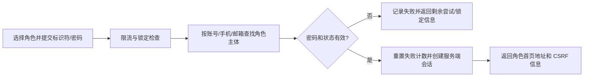
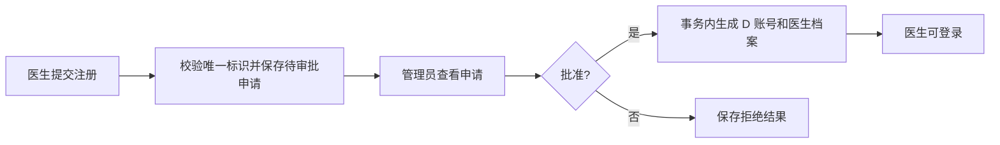
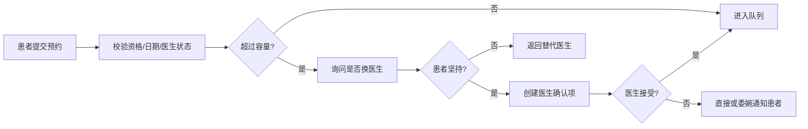
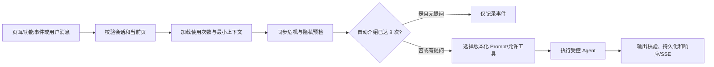

# 心理健康智能医疗助手 v1.0.0：需求与系统边界

状态：冻结基线
版本：1.0.0
日期：2026-08-06

## 1. 产品目标

提供一个可在 Windows 开发环境和 Linux 单实例容器中运行的心理健康智能医疗助手研究原型。系统服务患者、医生、助理、管理员和最高管理员，使用确定性业务规则完成身份、审批、人员目录、预约、排班和审计，以 DeepSeek 完成受控页面说明、基础问答和委婉通知。

系统不是医疗器械，不替代医生，不提供自动诊断、处方、剂量、停换药建议或紧急救援。出现立即危险时，界面优先提供现实求助指引；中国大陆环境提示 12356、110、120。

## 2. 角色与数据范围

| 角色 | 核心能力 | 可见数据 | 禁止能力 |
|---|---|---|---|
| 患者 | 注册、登录、页面助手、查看本人历史摘要、预约和处理超额协商 | 本人资料、本人就诊/预约、医生公开状态与队列人数 | 查看他人病历、修改医生容量、绕过预约规则 |
| 医生 | 登录、维护未来两天容量、查看本人队列、处理超额预约、查看夜班、使用只读工作助手 | 分配给本人或待本人确认的患者最小必要信息、本人排班 | 查看无关患者、自动诊断/处方、替患者接受决定 |
| 助理 | 登录、查看待协调事项、医生安排、夜班和只读库存摘要、使用工作助手 | 协调所需最小字段 | 查看病历正文、诊断、证件号、执行医疗决定 |
| 管理员 | 登录、查看患者/医生基本状态、审批医生注册、管理合规状态 | 账号、角色、黑名单、在职/审批等管理字段 | 查看其他管理员、病历正文、明文密码/证件号 |
| 最高管理员 | 普通管理员能力及查看其他管理员基本信息 | 管理所需最小字段 | 明文密码、完整证件号、无审计的敏感操作 |

所有角色的身份、权限和数据范围以服务端会话为准，不信任请求体中的 `user_id` 或 `role`。

## 3. v1.0.0 必须实现的用例

### 3.1 认证与注册

- 用户选择角色后以系统账号、手机号或邮箱加密码登录。
- 角色、标识符和密码匹配后进入对应角色首页；失败返回可理解但不泄露账号存在性的提示。
- 同一登录主体连续失败 8 次锁定 5 分钟；第 7 次提示剩余 1 次，第 8 次提示已锁定及剩余时间。
- 患者提交密码、身份证等基本信息后直接生成 `P###` 账号。
- 医生提交基本信息后生成待审批申请；管理员批准后生成 `D###` 账号，拒绝则不创建可登录医生账号。
- 初始合成账号：1 个最高管理员、2 个普通管理员、5 个医生、50 个患者、2 个助理；凭据只保存在被 Git 忽略且访问受限的私有文件中。

### 3.2 管理目录

- 普通管理员可查看患者和医生的账号、黑名单、在职/启用、审批等基本管理字段。
- 最高管理员额外可查看普通管理员与最高管理员的基本管理字段。
- 所有查询写入审计日志；接口不返回密码哈希、pepper、完整身份证或无关医疗信息。

### 3.3 患者页面助手

- 患者端右侧常驻助手在进入页面或功能时说明当前功能，并只回答当前页相关问题。
- 记忆跨页面保留；同一用户对同一功能的自动介绍达到 8 次后停止，用户主动询问仍可回答。
- Prompt 模板由后端按功能 ID 选择，模型不能由前端自由替换系统 Prompt。
- 助手根据出生日期计算年龄，对老人和儿童使用更尊重、清晰且不幼稚化的措辞。
- 用户提出正式诊疗意图时，助手引导到患者诊疗专用界面，展示历史医生、当前工作/休假状态、预计休假剩余时间和排队信息。

### 3.4 预约、容量与协调

- 患者完成就诊达到 10 次后，才可指定医生；未达到时只能使用系统分配或普通候选流程。
- 患者可查看医生在目标日期的预约人数，指定医生仍需排队。
- 医生每天仅能设置未来两天各自的接诊人数。
- 超过容量时先询问患者是否换医生；患者坚持后创建医生确认项。
- 医生可接受或拒绝；拒绝时可选择直接通知或由模型生成委婉通知。模型只润色已确定结论，不能改变接受/拒绝结果。
- 助理可查看需要三方协调的待办，不代替患者或医生做决定。
- 每个自然日恰有 1 名医生值夜班；冲突由数据库约束和事务阻止。

### 3.5 医生与助理工作助手

- 医生助手只读查询本人队列、本人排班、可见患者最小摘要、夜班及库存摘要。
- 助理助手只读查询协调队列、医生工作/休假安排、夜班及库存摘要。
- 药物库存只返回药品名称、规格标识、库存数量、单位、批次有效期和库存状态，不生成剂量、处方、替代药或用药建议。
- 模型只能调用注册表中当前角色可见的工具；参数、权限和业务范围必须在工具执行前由确定性代码校验。

### 3.6 运行与审计

- 每次 API 请求有 `request_id`，关键登录、管理、助手、工具、预约和排班动作可追溯。
- 助手记录功能使用次数、会话消息、Agent 运行状态和工具调用摘要；不在普通日志记录密码、密钥、证件号、联系方式或完整心理对话。
- DeepSeek 不可用时，登录、查询、预约、排班和危机支持仍可运行；自然语言回答返回明确降级状态，不伪造模型结果。

## 4. 核心业务流程

### 4.1 登录



### 4.2 医生注册审批



### 4.3 超额预约



### 4.4 页面助手



## 5. 模块边界

```text
fronts (浏览器页面)
  -> versioned HTTP/SSE API
backend/app/api (协议、认证入口、响应映射)
  -> backend/app/services (用例、事务、幂等、审计)
backend/app/agents + workflows (受控决策与状态机)
  -> llm / tools / prompts / safety
  -> repositories
backend/app/repositories
  -> SQLite on E: (Windows) / mounted SQLite volume (Linux v1)
```

- `api` 不直接执行 SQL、实例化 DeepSeek 或决定预约规则。
- `services` 是 HTTP 与 Agent 工具共享的唯一业务入口。
- `agents` 不能绕过 Service/Repository 读取敏感字段。
- `repositories` 不依赖 API、Agent 或前端。
- `fronts` 只展示后端事实和标准事件，不重算资格、权限或风险。

## 6. 接口清单基线

阶段 2 将冻结字段级契约；v1.0.0 至少包含：

- 认证：登录、登出、当前会话、患者注册、医生注册、医生审批。
- 目录：管理员按角色查看最小基本信息。
- 患者助手：页面/功能响应、历史消息、功能使用状态、诊疗导航。
- 预约：医生容量、患者预约、患者超额决定、医生确认、助理协调队列。
- 排班：夜班查询与受权设置。
- 工作助手：医生/助理响应及角色只读工具查询。
- 异步/SSE：创建运行、查询状态、订阅事件、取消运行。
- 运行：存活检查、就绪检查、受保护运行指标。

## 7. 数据实体清单基线

- 身份与权限：`users`、角色/档案、登录标识符、会话、登录尝试、注册申请。
- 医疗业务最小数据：就诊摘要、医生工作状态/休假、容量、预约、协调决定、夜班。
- 助手：页面功能、Prompt 模板、使用计数、会话、消息、Agent 运行、事件、工具调用。
- 工作支持：药物库存只读记录、协调待办。
- 治理：审计日志、API 限流桶、幂等键、系统事件、schema 版本。

身份证、密码和 API Key 不作为普通业务响应实体；身份证仅保存不可逆查重值和必要脱敏显示值，密码使用带 pepper 的强哈希。

## 8. 非目标与后续版本

v1.0.0 不实现：

- 通用文件上传、知识库、Embedding、RAG 或向量数据库。
- 真实处方、药品采购/出入库写操作、自动医疗诊断或风险分级关闭。
- WebSocket、多节点共享 SQLite、自动扩缩容或生产级 PostgreSQL/Redis/MinIO 集群。
- 医保、支付、短信/邮件、HIS/EMR、真实医生执业认证等外部集成。
- 多 Agent 自主协作。需要跨角色协调的流程使用确定性状态机和人工确认。

上述能力只能在另立需求、数据合规、安全评审和迁移方案后加入。

## 9. 非功能要求

- 正确性：资格、容量、唯一夜班、锁定和权限由数据库约束/确定性代码保证。
- 安全性：Cookie/CSRF、最小权限、请求体限制、角色/数据范围、限流、脱敏日志。
- 可恢复性：迁移可演练；数据库不可用、模型超时和客户端断流形成明确失败状态。
- 可观测性：请求、Agent 运行、工具调用和关键状态变更可用 ID 关联。
- 可移植性：Windows 使用 E 盘 SQLite；Linux 使用显式挂载路径；不把本地绝对路径写死在业务代码。
- 性能目标：不含模型的常规本地查询 P95 小于 500 ms；首个 SSE 状态事件目标小于 1 s；模型超时可配置且有受控降级。

## 10. 阶段 1 验收结论

- 五种角色、数据范围和核心用例已冻结。
- 认证、目录、助手、预约、夜班、只读工作助手和运行治理均有明确边界。
- 医疗安全、隐私、E 盘单实例和 DeepSeek 降级边界已明确。
- 接口与实体清单已足以进入第 2 阶段字段级 API/数据结构设计。
